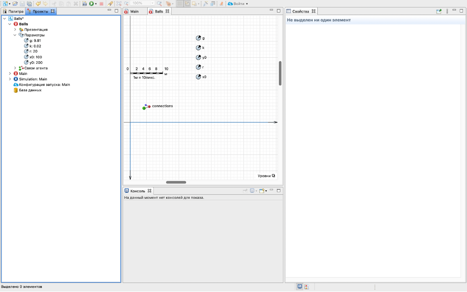
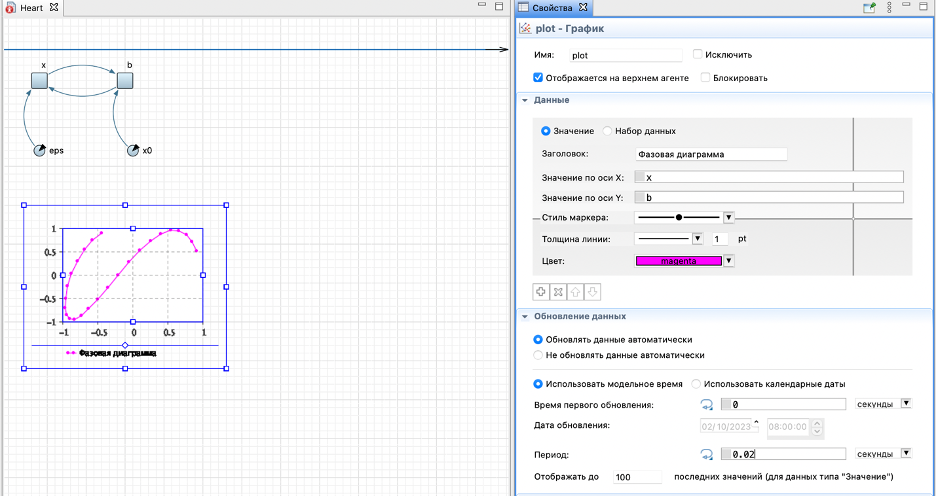

МИНИСТЕРСТВО ОБРАЗОВАНИЯ И НАУКИ РОССИЙСКОЙ ФЕДЕРАЦИИ

Автономная некоммерческая образовательная организация высшего образования «Научно-технологический университет «Сириус»

Кафедра «Сетевого и системного администрирования»

Отчет по лабораторной работе 

На тему «Создание модели прыгающих мячей и модели сердца»

Работу выполнила: 

Студентка 2 курса 1.11.6.1 группы

Кафедры «Сетевого и 

системного администрирования»

Лазькова Валерия Юрьевна

Работу проверил:

преподаватель

Головин Вячеслав Александрович

Федеральная территория «Сириус» - 2023

**Лабораторная работа**

Пояснительная записка 37 с., 34 рис, 1 источник.

ANYLOGIC, МОДЕЛИРОВАНИЕ, ИМИТАЦИОННОЕ МОДЕЛИРОВАНИЕ .

Объектом исследования является программное обеспечение для математического моделирования – AnyLogic.

Предмет исследования – программное обеспечение AnyLogic.

Целью исследований является знакомство с интерфейсом программы, освоение технологии имитационного моделирования, реализованной в программе AnyLogic.

`	`В ходе работы с помощью программного обеспечения AnyLogic были созданы две математические модели: модель прыгающих мячей и модель пульсирующего сердца.  

`	`В результате выполнения работы модели были успешно созданы в программном обеспечении AnyLogic.

#

**СОДЕРЖАНИЕ**
#
[ТЕОРЕТИЧЕСКИЕ АСПЕКТЫ ПРОЕКТА	4****](#_toc148344972)**

[**ПРАКТИЧЕСКАЯ ЧАСТЬ	5****](#_toc148344973)

[**Лабораторная работа №1.1	5****](#_toc148344974)

[1.1.1 Создание новой модели	5](#_toc148344975)

[1.1.2 Создание нового типа агента	6](#_toc148344976)

[1.1.3 Создание класса активного объекта	6](#_toc148344977)

[1.1.4 Добавление объектов Параметр на диаграмму класса	7](#_toc148344978)

[1.1.5  Настройка добавленных параметров	8](#_toc148344979)

[1.1.6 Добавление на диаграмму объектов «Накопитель»	9](#_toc148344980)

[1.1.7 Свойства накопителя vy	10](#_toc148344981)

[1.1.8 Завершенные зависимости переменных	12](#_toc148344982)

[1.1.9 Добавление объектов диаграммы состояний	14](#_toc148344983)

[1.1.10 Свойства перехода	15](#_toc148344984)

[1.1.11 Создание объектов графического моделирования	16](#_toc148344985)

[1.1.12 Связывание объектов презентации диаграммы Main с установленными параметрами диаграммы Ball	17](#_toc148344986)

[1.1.13 Запуск модели	18](#_toc148344987)

[**Лабораторная работа №1.2	19****](#_toc148344988)

[2.1 Цвет мяча при отскоке. Свойства параметра	19](#_toc148344989)

[2.2 Добавление выражения в переход	20](#_toc148344990)

[2.3 Свойства овала. Изменение цвета.	21](#_toc148344991)

[2.4 Создание второго мяча	22](#_toc148344992)

[2.6 Произвольные перемещения мяча	23](#_toc148344993)

[2.7 Изменение условий столкновения объекта с гранями	23](#_toc148344994)

[2.8 Добавление дополнительного перехода и редактирование свойств	24](#_toc148344995)

[2.9 Запуск модели	24](#_toc148344996)

[**Лабораторная работа №1.3	26****](#_toc148344997)

[3.1 Свойства накопителя	26](#_toc148344998)

[3.2 Проверка на ошибки в модели	28](#_toc148344999)

[3.3 Добавления параметра x0	29](#_toc148345000)

[3.4 Связи между элементами диаграммы	30](#_toc148345001)

[3.5 Запуск модели	30](#_toc148345002)

[3.6 Построение графиков	31](#_toc148345003)

[3.7 Запуск модели	32](#_toc148345004)

[3.8 Изменение динамических параметров графических объектов	34](#_toc148345005)

[**ЗАКЛЮЧЕНИЕ	35****](#_toc148345006)

[**СПИСОК ИСПОЛЬЗОВАННЫХ ИСТОЧНИКОВ	36****](#_toc148345007)

## **ТЕОРЕТИЧЕСКИЕ АСПЕКТЫ ПРОЕКТА**
**AnyLogic** – это программное обеспечение для моделирования и симуляции с помощью графического интерфейса. Оно используется для создания разных видов моделей, например, для исследования и оптимизации процессов в производстве, логистике, транспорте и здравоохранении. AnyLogic помогает анализировать и принимать решения, основываясь на симуляциях сложных систем.

**Имитационное моделирование** - это метод моделирования, который использует компьютерное программное обеспечение, чтобы создавать виртуальные модели различных систем и процессов. Этот метод позволяет изучать, анализировать и предсказывать поведение реальных систем, создавая виртуальную версию этих систем и взаимодействуя с ней.

Основная идея имитационного моделирования заключается в том, чтобы создать компьютерную модель, которая имитирует реальную систему или процесс на основе определенных предположений и параметров. Затем эта модель запускается в компьютерной программе, и проводятся различные эксперименты и симуляции, чтобы изучить поведение системы в различных условиях и сценариях.

## **ПРАКТИЧЕСКАЯ ЧАСТЬ**

## **Лабораторная работа №1.1**

### **1.1.1 Создание новой модели**
Перед началом выполнения работы нужно создать модель. В меню «Файл», пункт «Создать». Далее указываем имя модели и папку для сохранения модели. 

См. рис. 1.1 (на рисунке присутствует замечание, что такая модель уже существует, это так, скриншот был сделан после выполнения работы для демонстрации данного этапа работы)

Рис. 1.1.1 – Создание новой модели

Далее выбираем пункт «Начать создание модели «с нуля»» и нажать кнопку Готово.

### **1.1.2 Создание нового типа агента**
Выбираем пункт «Создать новый тип агента с нуля» и завершить создание модели.

См. рис. 1.1.2 (на рисунке присутствует замечание, что создать такой тип агента не получится, это так, скриншот был сделан после выполнения работы для демонстрации данного этапа работы)

Рис. 1.1.2 – Создание нового типа агента

### **1.1.3 Создание класса активного объекта**
Для создания класса активного объекта, требуется на уже имеющийся класс Main и в контекстном меню выбрать Создать − Класс активного объекта. 

### **1.1.4 Добавление объектов Параметр на диаграмму класса**
Для того, чтобы создать параметры, следует выбрать во окне «Палитра», далее выбрать вкладку «Основная» и перетащить значок параметра в рабочею область. 

Необходимо добавить на диаграмму пять объектов Параметр: g, k, r,  x0, y0.

См. рис. 1.1.4

Рис. 1.1.4 – Добавление объектов Параметр

### **1.1.5  Настройка добавленных параметров**
У созданных параметров нужно указать значения по умолчанию:

g – 9.81;

k – 0.02; 

r – 20; 

x0 – 100; 

y0 – 200.

См. рис. 1.1.5

Рис. 1.1.5 – Настройка добавленных параметров

### **1.1.6 Добавление на диаграмму объектов «Накопитель»** 
Добавим четыре «Накопителя» – динамические переменные, которые находятся в окне Палитра на вкладке Системная динамика. 

См. рис. 1.1.6

Рис. 1.1.6 – Добавление на диаграмму объектов «Накопитель» 

### **1.1.7 Свойства накопителя vy** 
Для Накопителя vy, требуется установить начальное значение – 0, значение дифференциальной функции - -g. 

См. рис. 1.1.7

Рис. 1.1.7 - Свойства накопителя vy
#### **1.1.7.1 Свойства накопителя vy** 
Накопитель vx, будет иметь нулевое свойство связи. 

См.рис. 1.1.7.1

Рис. 1.1.7.1 - Свойства накопителя vx
#### **1.1.7.2 Свойства накопителя x** 
См.рис. 1.1.7.2

Рис. 1.1.7.2 - Свойства накопителя x

]

#### **1.1.7.3 Свойства накопителя y**
См.рис. 1.1.7.3

Рис. 1.1.7.2 - Свойства накопителя 3

### **1.1.8 Завершенные зависимости переменных**
На диаграмме автоматически появятся тонкие голубые стрелки. Для улучшения наглядности можно редактировать внешний вид стрелок зависимостей, а именно изменять их цвет и радиус закругления. 

Если связи не появились автоматически, то необходимо нажать на накопитель, затем на  Исправить ошибки в связях и Создать недостающие связи.

См. рис. 1.1.8

Рис. 1.1.8 – Завершенные зависимости переменных

### **1.1.9 Добавление объектов диаграммы состояний** 
Для того, чтобы придать объекту какое-либо состояние, выполняемое действие. Требуется создать «Диаграмму состояний», для этого из окна «Палитра», нужно перенести «Начало диаграммы состояний», «Состояние», «Переход». 

См. рис. 1.1.9

Рис. 1.1.9 – Добавление объектов диаграммы состояний

### **1.1.10 Свойства перехода**
Требуется выполнить условия касания поверхности земли при движении мяча вниз, записываемое выражением: 

y <= r && vy < 0 в поле «Условие»

Скорость мяча, изменяемая после отскока от земли будет задана выражением: 

vy=-(1-k)\*vy в поле «Действие». 

См. рис. 1.1.10

Рис. 1.1.10 – Свойства перехода

### **1.1.11 Создание объектов графического моделирования**
Для графического представления математической модели «Ball», требуется представить мяч в виде закрашенного шара, а для изменения динамики поведения объекта, требуется разместить контроли управления объектом в виде «Ползунков». 

Далее добавим вложенный объект, путем перетаскивания из окна Проект класса активного объекта Ball на диаграмму Main.

См. рис. 1.1.11

Рис. 1.1.11 – Создание объектов графического моделирования

### **1.1.12 Связывание объектов презентации диаграммы Main с установленными параметрами диаграммы Ball**
Далее требуется установить значения для бегунков, задающих поведение объекта овал в графическом пространстве. 

См. рис. 1.1.12

Рис. 1.1.12 – Свойства объектов бегунки

Рис. 1.1.12.1 – Свойства объектов бегунки

Рис. 1.1.12.2 – Свойства объектов бегунки

### **1.1.13 Запуск модели**
Запускаем модель и видим графическое отображение объектов в зависимости от заданных настроек. 

Для сбора, отображения и анализа данных во время выполнения модели одним из способов просмотра текущего значения и истории изменения значений переменной или параметра во время выполнения модели является использование окна инспекта.

См. рис. 1.1.13

Рис. 1.1.13 – Запуск модели

## **Лабораторная работа №1.2**

### **2.1 Цвет мяча при отскоке. Свойства параметра**
Представление мяча при желании можно дополнять и цветовой палитрой. 

Далее создаем параметр t0 и присваиваем значение по умолчанию -1. 

См. рис. 2.1

Рис. 2.1 – Свойства параметра t0

### **2.2 Добавление выражения в переход**
Для того, чтобы действия регистрировались в момент времени в математической модели, требуется записывать действия в переход, с помощью выражения: 

t0 = time(). 

См. рис. 2.2

Рис. 2.2 - Добавление выражения в переход

### **2.3 Свойства овала. Изменение цвета.**
Для того, чтобы мяч автоматически изменял цвет заливки требуется внести поправки в свойства объекта овал. Выбрать динамический тип заливки, вписав выражение :

time() < ball.t0 + 0.3 ? red: lime

Объект будет приобретать красный цвет каждые трое секунд. 

См. рис. 2.3

Рис. 2.3 - Свойства заливки овала
###

### **2.4 Создание второго мяча**
Далее требуется определить для объекта овал в презентации свойства, измененные для связи со вторым экземпляром класса. 

Для того чтобы на презентации показать движение второго мяча, продублируйте изображение первого мяча. Параметры нового мяча (координаты и цвета) связаны с характеристиками объекта ball. Их нужно связать с новым объектом – шаром с именем Ball1. То есть, вместо Bаlls.x, Balls.у и Bаlls.t0 в соответствующих полях нужно записать Bаlls1.x, Balls1.у и Bаlls1.t0.

А для значения радиусов Радиус X и Радиус Y нужно установить Balls1.r вместо Balls.r.

См. ри. 2.4

Рис. 2.4 – Создание второго мяча

### **2.6 Произвольные перемещения мяча**
Требуется задать случайные скорости для мячей, для этого следует изменить свойства одного из накопителей, с нуля на uniform(-100, 100). Тоже самое следует применить к накопителю vy. 

### **2.7 Изменение условий столкновения объекта с гранями**
Для моделирования отскока мяча от потолка нужно на переходе изменить условие столкновения мяча с поверхностью. Панели свойств перехода активного объекта Ball выражение: 

у <= r && vy < 0 требуется изменить на: 

у <= r && vy < 0 || у >= 500 - r && vy > 0. 

См. рис. 2.7

Рис. 2.7 – Изменение условий столкновения объекта с гранями
### **2.8 Добавление дополнительного перехода и редактирование свойств**
Для моделирования отскока мяча от стен нужно создать новый переход, изменить условие столкновения мяча с поверхностью. Панели свойств перехода активного объекта Ball выражение: 

х <= r && vx < 0 || х >= 500 - r && vx > 0. 

См. рис. 2.8

Рис. 2.8 - Добавление дополнительного перехода и редактирование свойств

### **2.9 Запуск модели**
Проверка работоспособности в графической представляющие математической модели. 

См. рис. 2.9

Рис. 2.9 – Запуск модели

[Ссылка на видео работы модели](https://disk.yandex.ru/d/V-TLi3Bw-CR5uw)

## **Лабораторная работа №1.3**

### **3.1 Свойства накопителя**
Для создания модели имитации работы сердца, требуется создать два накопителя x и b, со следующими свойствами. 

По x: начальное значение – x0, значение дифференциала функции - (x - х\*x\*x - b) /eps. 

См. рис. 3.1

Рис. 3.1 – Свойства накопителя x

Свойства накопителя b: начальное значение – 0, значение дифференциала функции - x – x0. 

См. рис. 3.1.2

Рис. 3.1.2 - Свойства накопителя b
### **3.2 Проверка на ошибки в модели** 
Для проверки правильности синтаксиса модели можно использовать кнопку Построить модель панели инструментов или нажать клавишу F7.

См. рис. 3.2

Рис. 3.2 – Ошибки модели

### **3.3 Добавления параметра x0**
Для исправления выявленных ошибок, требуется добавить два параметра. Первый x0, со свойствами значения по умолчанию 0.5. 

См. рис. 3.3

Рис. 3.3 – Добавления параметра x0

Второй eps, со свойствами значения по умолчанию 0.01. См. рис. 3.3.1

Рис. 3.3.1 - Добавление параметра eps
### **3.4 Связи между элементами диаграммы**
В результате создания двух параметров при повторном запуске «Построить модель», выстроятся связи между элементами диаграммы. 

См. рис. 3.4

Рис. 3.4 – Связи между элементами диаграммы

### **3.5 Запуск модели**
При запуске проекта, переменные b и х в этом окне начнут изменяться в соответствии с определенными для них уравнениями. 

См. рис. 3.5

Рис. 3.5 – Запуск модели

### **3.6 Построение графиков**
Построим графики зависимостей переменных b и х от времени и фазовую диаграмму b от х. Для этого выбрать график из палитры «Статистика». В свойствах графика, поле значение по оси X введите имя переменной х, а в поле значение по оси Y – имя переменной̆ b. Для того чтобы получить гладкую диаграмму нужно уменьшить период обновления данных в поле Период до значения 0.02. 

См. рис. 3.6

Рис. 3.6 – Построение графиков

Аналогично нужно построить временной график для переменных x и b, разместив их на одном графике. С временным диапазоном равным 10. 

См. рис. 3.6.1

Рис. 3.6.1 – Временной график
### **3.7 Запуск модели**
Рабочая модель с меняющимися графиками. Вы также можете изменить дизайн для вашей модели.

См. рис. 3.7

Рис. 3.7 – Запуск модели

[Ссылка на видео работы модели](https://disk.yandex.ru/d/V-TLi3Bw-CR5uw)

### **3.8 Изменение динамических параметров графических объектов** 
Добавить объект Овал на диаграмму класса. Изменить свойства, цвет заливки - бордовый, цвет линии границы - красный; толщину линии границы установить 2. 

Установить динамические параметры для Радиуса X и Радиуса Y.

## **ЗАКЛЮЧЕНИЕ**
При выполнении работы математические модели были успешно созданы и запущены в программном обеспечении AnyLogic. 

В ходе лабораторной работы, проблем с ее выполнением не возникло.
## **СПИСОК ИСПОЛЬЗОВАННЫХ ИСТОЧНИКОВ**
1. Справочные материалы лабораторных работ по математическому моделированию Головин В.А.
36

